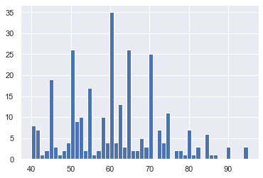
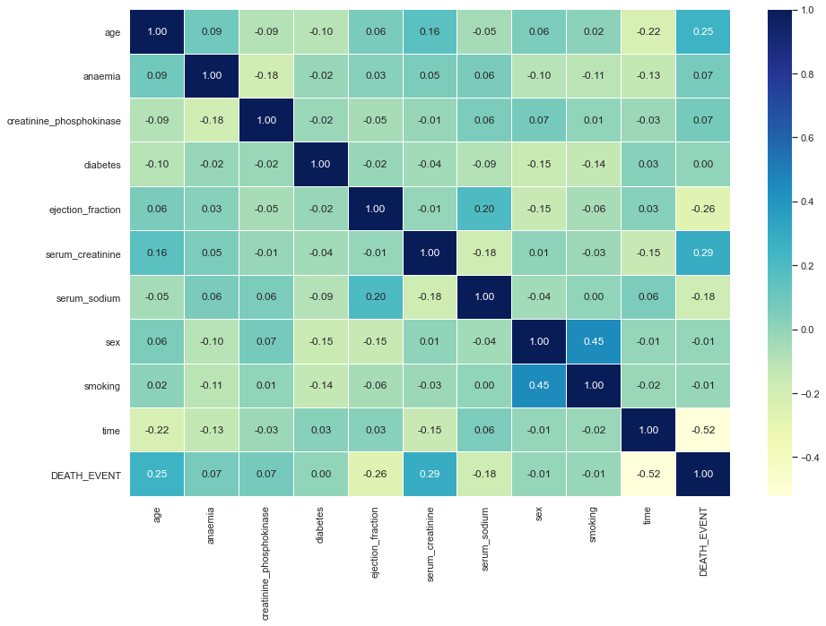

## About our dataset


    Cardiovascular diseases (CVDs) are the number 1 cause of death globally, taking an estimated 17.9 million lives each year, which accounts for 31% of all deaths worlwide.
    Heart failure is a common event caused by CVDs and this dataset contains 12 features that can be used to predict mortality by heart failure.

    Most cardiovascular diseases can be prevented by addressing behavioural risk factors such as tobacco use, unhealthy diet and obesity, physical inactivity and harmful use of alcohol using population-wide strategies.
   **Data Source** https://www.kaggle.com/andrewmvd/heart-failure-clinical-data
    
## Task
Create a model for predicting mortality caused by Heart Failure. <br>
12 clinical features for predicting death events.


## Our Machine Learning WorkFlow

I feel a lot comfortable defining my workflow for solving a machine learning problem before ever starting to solve those problem as that gives me a feel of direction. However, this may be different for someother persons ✍🏻

**Below are the steps we are going to take to solve this machine learning problem**
1. Problem Definition and Data Collection
    
2. Get the data ready for use (Data Preprocessing)
    * Check for missing values
    * Fill missing values, if any.
    * Turn categorical Features to Numerical
3. Feature Engineering: 
   Feature engineering is the process of using domain knowledge to extract features (characteristics, properties, attributes) from raw data. A feature is a property shared by independent units on which analysis or prediction is to be done. Features are used by predictive models and influence results.
   
4. Modeling
5. Make Predictions
6. Evaluate Model Performance metrics
7. See if we need to improve our model
8. Export our trained model
9. Load our trained model

## 1. Problem Definition
People with cardiovascular disease or who are at high cardiovascular risk (due to the presence of one or more risk factors such as hypertension, diabetes, hyperlipidaemia or already established disease) need early detection and management wherein a machine learning model can be of great help.

## Data Collection


```python
import pandas as pd
import matplotlib.pyplot as plt
import numpy as np
import seaborn as sns
```


```python
df = pd.read_csv('Datasets/heart_failure_clinical_records_dataset.csv')
```


```python
df.head()
```


<div>
<style scoped>
    .dataframe tbody tr th:only-of-type {
        vertical-align: middle;
    }

    .dataframe tbody tr th {
        vertical-align: top;
    }

    .dataframe thead th {
        text-align: right;
    }
</style>
<table border="1" class="dataframe">
  <thead>
    <tr style="text-align: right;">
      <th></th>
      <th>age</th>
      <th>anaemia</th>
      <th>creatinine_phosphokinase</th>
      <th>diabetes</th>
      <th>ejection_fraction</th>
      <th>high_blood_pressure</th>
      <th>platelets</th>
      <th>serum_creatinine</th>
      <th>serum_sodium</th>
      <th>sex</th>
      <th>smoking</th>
      <th>time</th>
      <th>DEATH_EVENT</th>
    </tr>
  </thead>
  <tbody>
    <tr>
      <th>0</th>
      <td>75.0</td>
      <td>0</td>
      <td>582.0</td>
      <td>0.0</td>
      <td>20.0</td>
      <td>1</td>
      <td>265000</td>
      <td>1.9</td>
      <td>130.0</td>
      <td>1.0</td>
      <td>0.0</td>
      <td>4.0</td>
      <td>1</td>
    </tr>
    <tr>
      <th>1</th>
      <td>55.0</td>
      <td>0</td>
      <td>7861.0</td>
      <td>0.0</td>
      <td>38.0</td>
      <td>0</td>
      <td>263358.03</td>
      <td>1.1</td>
      <td>136.0</td>
      <td>1.0</td>
      <td>0.0</td>
      <td>6.0</td>
      <td>1</td>
    </tr>
    <tr>
      <th>2</th>
      <td>65.0</td>
      <td>0</td>
      <td>146.0</td>
      <td>NaN</td>
      <td>NaN</td>
      <td>0</td>
      <td>162000</td>
      <td>1.3</td>
      <td>129.0</td>
      <td>1.0</td>
      <td>1.0</td>
      <td>7.0</td>
      <td>1</td>
    </tr>
    <tr>
      <th>3</th>
      <td>50.0</td>
      <td>1</td>
      <td>111.0</td>
      <td>0.0</td>
      <td>20.0</td>
      <td>0</td>
      <td>210000</td>
      <td>1.9</td>
      <td>137.0</td>
      <td>1.0</td>
      <td>0.0</td>
      <td>7.0</td>
      <td>1</td>
    </tr>
    <tr>
      <th>4</th>
      <td>65.0</td>
      <td>1</td>
      <td>NaN</td>
      <td>1.0</td>
      <td>20.0</td>
      <td>0</td>
      <td>327000</td>
      <td>2.7</td>
      <td>116.0</td>
      <td>0.0</td>
      <td>0.0</td>
      <td>8.0</td>
      <td>1</td>
    </tr>
  </tbody>
</table>
</div>


```python
# Let's get a summary of our data set
df.info()
```

    <class 'pandas.core.frame.DataFrame'>
    RangeIndex: 299 entries, 0 to 298
    Data columns (total 13 columns):
     #   Column                    Non-Null Count  Dtype  
    ---  ------                    --------------  -----  
     0   age                       298 non-null    float64
     1   anaemia                   299 non-null    int64  
     2   creatinine_phosphokinase  292 non-null    float64
     3   diabetes                  294 non-null    float64
     4   ejection_fraction         294 non-null    float64
     5   high_blood_pressure       296 non-null    object 
     6   platelets                 288 non-null    object 
     7   serum_creatinine          299 non-null    float64
     8   serum_sodium              294 non-null    float64
     9   sex                       298 non-null    float64
     10  smoking                   298 non-null    float64
     11  time                      297 non-null    float64
     12  DEATH_EVENT               299 non-null    int64  
    dtypes: float64(9), int64(2), object(2)
    memory usage: 30.5+ KB


```python
# Check for duplicate
df.duplicated().sum()
```


    0


```python
# Let's check how correlated each feature is to another
correlation = df.corr()
correlation
```


<div>
<style scoped>
    .dataframe tbody tr th:only-of-type {
        vertical-align: middle;
    }

    .dataframe tbody tr th {
        vertical-align: top;
    }

    .dataframe thead th {
        text-align: right;
    }
</style>
<table border="1" class="dataframe">
  <thead>
    <tr style="text-align: right;">
      <th></th>
      <th>age</th>
      <th>anaemia</th>
      <th>creatinine_phosphokinase</th>
      <th>diabetes</th>
      <th>ejection_fraction</th>
      <th>serum_creatinine</th>
      <th>serum_sodium</th>
      <th>sex</th>
      <th>smoking</th>
      <th>time</th>
      <th>DEATH_EVENT</th>
    </tr>
  </thead>
  <tbody>
    <tr>
      <th>age</th>
      <td>1.000000</td>
      <td>0.091852</td>
      <td>-0.088883</td>
      <td>-0.096539</td>
      <td>0.061344</td>
      <td>0.155650</td>
      <td>-0.052726</td>
      <td>0.059484</td>
      <td>0.018416</td>
      <td>-0.219635</td>
      <td>0.252176</td>
    </tr>
    <tr>
      <th>anaemia</th>
      <td>0.091852</td>
      <td>1.000000</td>
      <td>-0.184689</td>
      <td>-0.015766</td>
      <td>0.026149</td>
      <td>0.054518</td>
      <td>0.060957</td>
      <td>-0.099176</td>
      <td>-0.109526</td>
      <td>-0.133430</td>
      <td>0.066270</td>
    </tr>
    <tr>
      <th>creatinine_phosphokinase</th>
      <td>-0.088883</td>
      <td>-0.184689</td>
      <td>1.000000</td>
      <td>-0.022312</td>
      <td>-0.054024</td>
      <td>-0.012482</td>
      <td>0.057265</td>
      <td>0.074000</td>
      <td>0.005451</td>
      <td>-0.025688</td>
      <td>0.073627</td>
    </tr>
    <tr>
      <th>diabetes</th>
      <td>-0.096539</td>
      <td>-0.015766</td>
      <td>-0.022312</td>
      <td>1.000000</td>
      <td>-0.015566</td>
      <td>-0.043697</td>
      <td>-0.092627</td>
      <td>-0.154765</td>
      <td>-0.135563</td>
      <td>0.028746</td>
      <td>0.001362</td>
    </tr>
    <tr>
      <th>ejection_fraction</th>
      <td>0.061344</td>
      <td>0.026149</td>
      <td>-0.054024</td>
      <td>-0.015566</td>
      <td>1.000000</td>
      <td>-0.010466</td>
      <td>0.199457</td>
      <td>-0.146827</td>
      <td>-0.057282</td>
      <td>0.028818</td>
      <td>-0.261605</td>
    </tr>
    <tr>
      <th>serum_creatinine</th>
      <td>0.155650</td>
      <td>0.054518</td>
      <td>-0.012482</td>
      <td>-0.043697</td>
      <td>-0.010466</td>
      <td>1.000000</td>
      <td>-0.181161</td>
      <td>0.010253</td>
      <td>-0.026469</td>
      <td>-0.147806</td>
      <td>0.290386</td>
    </tr>
    <tr>
      <th>serum_sodium</th>
      <td>-0.052726</td>
      <td>0.060957</td>
      <td>0.057265</td>
      <td>-0.092627</td>
      <td>0.199457</td>
      <td>-0.181161</td>
      <td>1.000000</td>
      <td>-0.042738</td>
      <td>0.001440</td>
      <td>0.057033</td>
      <td>-0.175385</td>
    </tr>
    <tr>
      <th>sex</th>
      <td>0.059484</td>
      <td>-0.099176</td>
      <td>0.074000</td>
      <td>-0.154765</td>
      <td>-0.146827</td>
      <td>0.010253</td>
      <td>-0.042738</td>
      <td>1.000000</td>
      <td>0.446947</td>
      <td>-0.005693</td>
      <td>-0.007482</td>
    </tr>
    <tr>
      <th>smoking</th>
      <td>0.018416</td>
      <td>-0.109526</td>
      <td>0.005451</td>
      <td>-0.135563</td>
      <td>-0.057282</td>
      <td>-0.026469</td>
      <td>0.001440</td>
      <td>0.446947</td>
      <td>1.000000</td>
      <td>-0.019119</td>
      <td>-0.014233</td>
    </tr>
    <tr>
      <th>time</th>
      <td>-0.219635</td>
      <td>-0.133430</td>
      <td>-0.025688</td>
      <td>0.028746</td>
      <td>0.028818</td>
      <td>-0.147806</td>
      <td>0.057033</td>
      <td>-0.005693</td>
      <td>-0.019119</td>
      <td>1.000000</td>
      <td>-0.522918</td>
    </tr>
    <tr>
      <th>DEATH_EVENT</th>
      <td>0.252176</td>
      <td>0.066270</td>
      <td>0.073627</td>
      <td>0.001362</td>
      <td>-0.261605</td>
      <td>0.290386</td>
      <td>-0.175385</td>
      <td>-0.007482</td>
      <td>-0.014233</td>
      <td>-0.522918</td>
      <td>1.000000</td>
    </tr>
  </tbody>
</table>
</div>


```python
df.describe()
```


<div>
<style scoped>
    .dataframe tbody tr th:only-of-type {
        vertical-align: middle;
    }

    .dataframe tbody tr th {
        vertical-align: top;
    }

    .dataframe thead th {
        text-align: right;
    }
</style>
<table border="1" class="dataframe">
  <thead>
    <tr style="text-align: right;">
      <th></th>
      <th>age</th>
      <th>anaemia</th>
      <th>creatinine_phosphokinase</th>
      <th>diabetes</th>
      <th>ejection_fraction</th>
      <th>serum_creatinine</th>
      <th>serum_sodium</th>
      <th>sex</th>
      <th>smoking</th>
      <th>time</th>
      <th>DEATH_EVENT</th>
    </tr>
  </thead>
  <tbody>
    <tr>
      <th>count</th>
      <td>298.000000</td>
      <td>299.000000</td>
      <td>292.000000</td>
      <td>294.000000</td>
      <td>294.000000</td>
      <td>299.000000</td>
      <td>294.000000</td>
      <td>298.000000</td>
      <td>298.000000</td>
      <td>297.000000</td>
      <td>299.00000</td>
    </tr>
    <tr>
      <th>mean</th>
      <td>60.870248</td>
      <td>0.431438</td>
      <td>577.688356</td>
      <td>0.418367</td>
      <td>38.227891</td>
      <td>1.391104</td>
      <td>136.697279</td>
      <td>0.651007</td>
      <td>0.322148</td>
      <td>130.208754</td>
      <td>0.32107</td>
    </tr>
    <tr>
      <th>std</th>
      <td>11.898166</td>
      <td>0.496107</td>
      <td>972.468942</td>
      <td>0.494132</td>
      <td>11.852295</td>
      <td>1.034449</td>
      <td>4.338123</td>
      <td>0.477454</td>
      <td>0.468085</td>
      <td>77.365687</td>
      <td>0.46767</td>
    </tr>
    <tr>
      <th>min</th>
      <td>40.000000</td>
      <td>0.000000</td>
      <td>23.000000</td>
      <td>0.000000</td>
      <td>14.000000</td>
      <td>0.500000</td>
      <td>113.000000</td>
      <td>0.000000</td>
      <td>0.000000</td>
      <td>4.000000</td>
      <td>0.00000</td>
    </tr>
    <tr>
      <th>25%</th>
      <td>51.000000</td>
      <td>0.000000</td>
      <td>115.000000</td>
      <td>0.000000</td>
      <td>30.000000</td>
      <td>0.900000</td>
      <td>134.000000</td>
      <td>0.000000</td>
      <td>0.000000</td>
      <td>73.000000</td>
      <td>0.00000</td>
    </tr>
    <tr>
      <th>50%</th>
      <td>60.000000</td>
      <td>0.000000</td>
      <td>249.500000</td>
      <td>0.000000</td>
      <td>38.000000</td>
      <td>1.100000</td>
      <td>137.000000</td>
      <td>1.000000</td>
      <td>0.000000</td>
      <td>115.000000</td>
      <td>0.00000</td>
    </tr>
    <tr>
      <th>75%</th>
      <td>70.000000</td>
      <td>1.000000</td>
      <td>582.000000</td>
      <td>1.000000</td>
      <td>45.000000</td>
      <td>1.400000</td>
      <td>140.000000</td>
      <td>1.000000</td>
      <td>1.000000</td>
      <td>201.000000</td>
      <td>1.00000</td>
    </tr>
    <tr>
      <th>max</th>
      <td>95.000000</td>
      <td>1.000000</td>
      <td>7861.000000</td>
      <td>1.000000</td>
      <td>80.000000</td>
      <td>9.400000</td>
      <td>148.000000</td>
      <td>1.000000</td>
      <td>1.000000</td>
      <td>285.000000</td>
      <td>1.00000</td>
    </tr>
  </tbody>
</table>
</div>


### Definition of terms from the dataframe .describe() method above
* **Count**: Number of items of in a particular feature/Column <br>
* **Mean** Average number (Value gotten by dividing the sum of several quantities by their number) <br>
* **Std** Standard Deviation (Square root of variance **(How much values differ from the mean value)** ) <br>
* **Min** Minimum value in each feature or column <br>
* **Max** Maximum value in each feature or column <br>
* **Percentile** Splitting our data into different equal segments (25, 50, 75) etc.


```python
# Check number of columns and rows
df.shape #This shows that our dataset containes 299 rows and 13 columns
```


    (299, 13)


```python
# Let's checkout the column names
j = 0
for i in df.columns:
    j+=1
    print(j, i.upper())
```

    1 AGE
    2 ANAEMIA
    3 CREATININE_PHOSPHOKINASE
    4 DIABETES
    5 EJECTION_FRACTION
    6 HIGH_BLOOD_PRESSURE
    7 PLATELETS
    8 SERUM_CREATININE
    9 SERUM_SODIUM
    10 SEX
    11 SMOKING
    12 TIME
    13 DEATH_EVENT


```python
df['age'].T.hist(bins=50);
```


    

    


```python
# Let's Visualize our correlations better
# sns.set(font_scale=1)
fig, ax = plt.subplots(figsize=(15,10))
ax = sns.heatmap(correlation, annot=True, fmt='.2f', cmap='YlGnBu', linewidths=.05);
```


    

    


```python
pd.crosstab(df.age, df.DEATH_EVENT)
```


<div>
<style scoped>
    .dataframe tbody tr th:only-of-type {
        vertical-align: middle;
    }

    .dataframe tbody tr th {
        vertical-align: top;
    }

    .dataframe thead th {
        text-align: right;
    }
</style>
<table border="1" class="dataframe">
  <thead>
    <tr style="text-align: right;">
      <th>DEATH_EVENT</th>
      <th>0</th>
      <th>1</th>
    </tr>
    <tr>
      <th>age</th>
      <th></th>
      <th></th>
    </tr>
  </thead>
  <tbody>
    <tr>
      <th>40.000</th>
      <td>7</td>
      <td>0</td>
    </tr>
    <tr>
      <th>41.000</th>
      <td>1</td>
      <td>0</td>
    </tr>
    <tr>
      <th>42.000</th>
      <td>6</td>
      <td>1</td>
    </tr>
    <tr>
      <th>43.000</th>
      <td>1</td>
      <td>0</td>
    </tr>
    <tr>
      <th>44.000</th>
      <td>2</td>
      <td>0</td>
    </tr>
    <tr>
      <th>45.000</th>
      <td>13</td>
      <td>6</td>
    </tr>
    <tr>
      <th>46.000</th>
      <td>2</td>
      <td>1</td>
    </tr>
    <tr>
      <th>47.000</th>
      <td>1</td>
      <td>0</td>
    </tr>
    <tr>
      <th>48.000</th>
      <td>0</td>
      <td>2</td>
    </tr>
    <tr>
      <th>49.000</th>
      <td>3</td>
      <td>1</td>
    </tr>
    <tr>
      <th>50.000</th>
      <td>18</td>
      <td>8</td>
    </tr>
    <tr>
      <th>51.000</th>
      <td>3</td>
      <td>1</td>
    </tr>
    <tr>
      <th>52.000</th>
      <td>5</td>
      <td>0</td>
    </tr>
    <tr>
      <th>53.000</th>
      <td>9</td>
      <td>1</td>
    </tr>
    <tr>
      <th>54.000</th>
      <td>1</td>
      <td>1</td>
    </tr>
    <tr>
      <th>55.000</th>
      <td>14</td>
      <td>3</td>
    </tr>
    <tr>
      <th>56.000</th>
      <td>1</td>
      <td>0</td>
    </tr>
    <tr>
      <th>57.000</th>
      <td>1</td>
      <td>1</td>
    </tr>
    <tr>
      <th>58.000</th>
      <td>8</td>
      <td>2</td>
    </tr>
    <tr>
      <th>59.000</th>
      <td>1</td>
      <td>3</td>
    </tr>
    <tr>
      <th>60.000</th>
      <td>20</td>
      <td>13</td>
    </tr>
    <tr>
      <th>60.667</th>
      <td>1</td>
      <td>1</td>
    </tr>
    <tr>
      <th>61.000</th>
      <td>4</td>
      <td>0</td>
    </tr>
    <tr>
      <th>62.000</th>
      <td>4</td>
      <td>1</td>
    </tr>
    <tr>
      <th>63.000</th>
      <td>8</td>
      <td>0</td>
    </tr>
    <tr>
      <th>64.000</th>
      <td>3</td>
      <td>0</td>
    </tr>
    <tr>
      <th>65.000</th>
      <td>18</td>
      <td>8</td>
    </tr>
    <tr>
      <th>66.000</th>
      <td>2</td>
      <td>0</td>
    </tr>
    <tr>
      <th>67.000</th>
      <td>2</td>
      <td>0</td>
    </tr>
    <tr>
      <th>68.000</th>
      <td>3</td>
      <td>2</td>
    </tr>
    <tr>
      <th>69.000</th>
      <td>1</td>
      <td>2</td>
    </tr>
    <tr>
      <th>70.000</th>
      <td>18</td>
      <td>7</td>
    </tr>
    <tr>
      <th>72.000</th>
      <td>2</td>
      <td>5</td>
    </tr>
    <tr>
      <th>73.000</th>
      <td>3</td>
      <td>1</td>
    </tr>
    <tr>
      <th>75.000</th>
      <td>5</td>
      <td>6</td>
    </tr>
    <tr>
      <th>77.000</th>
      <td>1</td>
      <td>1</td>
    </tr>
    <tr>
      <th>78.000</th>
      <td>2</td>
      <td>0</td>
    </tr>
    <tr>
      <th>79.000</th>
      <td>1</td>
      <td>0</td>
    </tr>
    <tr>
      <th>80.000</th>
      <td>2</td>
      <td>5</td>
    </tr>
    <tr>
      <th>81.000</th>
      <td>1</td>
      <td>0</td>
    </tr>
    <tr>
      <th>82.000</th>
      <td>0</td>
      <td>3</td>
    </tr>
    <tr>
      <th>85.000</th>
      <td>3</td>
      <td>3</td>
    </tr>
    <tr>
      <th>86.000</th>
      <td>0</td>
      <td>1</td>
    </tr>
    <tr>
      <th>87.000</th>
      <td>0</td>
      <td>1</td>
    </tr>
    <tr>
      <th>90.000</th>
      <td>1</td>
      <td>2</td>
    </tr>
    <tr>
      <th>94.000</th>
      <td>0</td>
      <td>1</td>
    </tr>
    <tr>
      <th>95.000</th>
      <td>0</td>
      <td>2</td>
    </tr>
  </tbody>
</table>
</div>


## 2. Data Preprocessing

## Check if there are missing values


```python
df.isna()
```


<div>
<style scoped>
    .dataframe tbody tr th:only-of-type {
        vertical-align: middle;
    }

    .dataframe tbody tr th {
        vertical-align: top;
    }

    .dataframe thead th {
        text-align: right;
    }
</style>
<table border="1" class="dataframe">
  <thead>
    <tr style="text-align: right;">
      <th></th>
      <th>age</th>
      <th>anaemia</th>
      <th>creatinine_phosphokinase</th>
      <th>diabetes</th>
      <th>ejection_fraction</th>
      <th>high_blood_pressure</th>
      <th>platelets</th>
      <th>serum_creatinine</th>
      <th>serum_sodium</th>
      <th>sex</th>
      <th>smoking</th>
      <th>time</th>
      <th>DEATH_EVENT</th>
    </tr>
  </thead>
  <tbody>
    <tr>
      <th>0</th>
      <td>False</td>
      <td>False</td>
      <td>False</td>
      <td>False</td>
      <td>False</td>
      <td>False</td>
      <td>False</td>
      <td>False</td>
      <td>False</td>
      <td>False</td>
      <td>False</td>
      <td>False</td>
      <td>False</td>
    </tr>
    <tr>
      <th>1</th>
      <td>False</td>
      <td>False</td>
      <td>False</td>
      <td>False</td>
      <td>False</td>
      <td>False</td>
      <td>False</td>
      <td>False</td>
      <td>False</td>
      <td>False</td>
      <td>False</td>
      <td>False</td>
      <td>False</td>
    </tr>
    <tr>
      <th>2</th>
      <td>False</td>
      <td>False</td>
      <td>False</td>
      <td>True</td>
      <td>True</td>
      <td>False</td>
      <td>False</td>
      <td>False</td>
      <td>False</td>
      <td>False</td>
      <td>False</td>
      <td>False</td>
      <td>False</td>
    </tr>
    <tr>
      <th>3</th>
      <td>False</td>
      <td>False</td>
      <td>False</td>
      <td>False</td>
      <td>False</td>
      <td>False</td>
      <td>False</td>
      <td>False</td>
      <td>False</td>
      <td>False</td>
      <td>False</td>
      <td>False</td>
      <td>False</td>
    </tr>
    <tr>
      <th>4</th>
      <td>False</td>
      <td>False</td>
      <td>True</td>
      <td>False</td>
      <td>False</td>
      <td>False</td>
      <td>False</td>
      <td>False</td>
      <td>False</td>
      <td>False</td>
      <td>False</td>
      <td>False</td>
      <td>False</td>
    </tr>
    <tr>
      <th>...</th>
      <td>...</td>
      <td>...</td>
      <td>...</td>
      <td>...</td>
      <td>...</td>
      <td>...</td>
      <td>...</td>
      <td>...</td>
      <td>...</td>
      <td>...</td>
      <td>...</td>
      <td>...</td>
      <td>...</td>
    </tr>
    <tr>
      <th>294</th>
      <td>False</td>
      <td>False</td>
      <td>False</td>
      <td>False</td>
      <td>False</td>
      <td>False</td>
      <td>True</td>
      <td>False</td>
      <td>False</td>
      <td>False</td>
      <td>False</td>
      <td>False</td>
      <td>False</td>
    </tr>
    <tr>
      <th>295</th>
      <td>False</td>
      <td>False</td>
      <td>False</td>
      <td>False</td>
      <td>False</td>
      <td>False</td>
      <td>False</td>
      <td>False</td>
      <td>False</td>
      <td>False</td>
      <td>False</td>
      <td>False</td>
      <td>False</td>
    </tr>
    <tr>
      <th>296</th>
      <td>False</td>
      <td>False</td>
      <td>False</td>
      <td>False</td>
      <td>False</td>
      <td>False</td>
      <td>True</td>
      <td>False</td>
      <td>False</td>
      <td>False</td>
      <td>False</td>
      <td>False</td>
      <td>False</td>
    </tr>
    <tr>
      <th>297</th>
      <td>False</td>
      <td>False</td>
      <td>False</td>
      <td>False</td>
      <td>False</td>
      <td>False</td>
      <td>True</td>
      <td>False</td>
      <td>False</td>
      <td>False</td>
      <td>False</td>
      <td>False</td>
      <td>False</td>
    </tr>
    <tr>
      <th>298</th>
      <td>False</td>
      <td>False</td>
      <td>False</td>
      <td>False</td>
      <td>False</td>
      <td>False</td>
      <td>True</td>
      <td>False</td>
      <td>False</td>
      <td>False</td>
      <td>False</td>
      <td>False</td>
      <td>False</td>
    </tr>
  </tbody>
</table>
<p>299 rows × 13 columns</p>
</div>


```python
df.isna().sum()
```


    age                          1
    anaemia                      0
    creatinine_phosphokinase     7
    diabetes                     5
    ejection_fraction            5
    high_blood_pressure          3
    platelets                   11
    serum_creatinine             0
    serum_sodium                 5
    sex                          1
    smoking                      1
    time                         2
    DEATH_EVENT                  0
    dtype: int64


✍🏻 Now, with the help of pandas .isna() method we are able to find out which columns have empty values in them

## Fill the missing values
When handling missing values in during your data exploration and engineering there are different ways to handle missing values.
1. Fill them with the mean, mode or median data of their parent column 
2. Removing the samples with missing data
3. Use of Unsupervised learning approach to predict and fill the data


```python
list(df.columns)
```


    ['age',
     'anaemia',
     'creatinine_phosphokinase',
     'diabetes',
     'ejection_fraction',
     'high_blood_pressure',
     'platelets',
     'serum_creatinine',
     'serum_sodium',
     'sex',
     'smoking',
     'time',
     'DEATH_EVENT']


## Split our data into Features and Label (Independent and Dependent Variables)


```python
# Split the data into features and labels
X = df.drop('DEATH_EVENT', axis=1)
y = df['DEATH_EVENT']
```


```python
# We can use the SimpleImputer Class in scikit learn to do this but
from sklearn.impute import SimpleImputer
from sklearn.compose import ColumnTransformer


# Let's Define the columns to fill
categoricals = ['platelets', 'high_blood_pressure']
numerical = ['age',
             'anaemia',
             'creatinine_phosphokinase',
             'diabetes',
             'ejection_fraction',
             'serum_creatinine',
             'serum_sodium',
             'sex',
             'smoking',
             'time'] # Removed the two categorical feature (high_blood_pressure and platelets)

# Define the way SimpleImputer will fill the missing values
categorical_imputer = SimpleImputer(strategy='constant', fill_value='None')
numerical_imputer = SimpleImputer(strategy='mean')

# Create the Imputer 
transformer = ColumnTransformer([('categoricals', categorical_imputer, categoricals),
                                 ('numerical', numerical_imputer, numerical)])

new_X = transformer.fit_transform(X)
```

# Congratulations!! 😎 💃 <br> We've successfully filled and converted all our data to numbers  

## 4. Modelling
Based on our problem and data, what machine learning model should we use? Let the audience decide 😉


Okay, you got it right 🤣, This is a classification problem because we are predicting whether our output is one thing or another i.e. whether it's 1 or 0, True or False, Rice or beans etc. In otherwords, we call this a **Binary Classification**


```python
from sklearn.ensemble import RandomForestClassifier

# Instantiate our model classes
random_forest_model, ada_boost = RandomForestClassifier(), AdaBoostClassifier()
```


```python
# Split our data into train and test splits
from sklearn.model_selection import train_test_split
X_train, X_test, y_train, y_test = train_test_split(new_X, y, train_size=.8, random_state=21)

# Let's Checkout the shape of our data to understand how our data is being split
X_train.shape, X_test.shape, y_train.shape, y_test.shape
```


    ((239, 12), (60, 12), (239,), (60,))


## Now Let's Train our machine learning model to find patterns in our data


```python
random_forest_model.fit(X_train, y_train)
```


    ---------------------------------------------------------------------------

    ValueError                                Traceback (most recent call last)

    <ipython-input-306-7b70e76ee335> in <module>
    ----> 1 random_forest_model.fit(X_train, y_train)
    

    /opt/anaconda3/lib/python3.8/site-packages/sklearn/ensemble/_forest.py in fit(self, X, y, sample_weight)
        302                 "sparse multilabel-indicator for y is not supported."
        303             )
    --> 304         X, y = self._validate_data(X, y, multi_output=True,
        305                                    accept_sparse="csc", dtype=DTYPE)
        306         if sample_weight is not None:


    /opt/anaconda3/lib/python3.8/site-packages/sklearn/base.py in _validate_data(self, X, y, reset, validate_separately, **check_params)
        431                 y = check_array(y, **check_y_params)
        432             else:
    --> 433                 X, y = check_X_y(X, y, **check_params)
        434             out = X, y
        435 


    /opt/anaconda3/lib/python3.8/site-packages/sklearn/utils/validation.py in inner_f(*args, **kwargs)
         61             extra_args = len(args) - len(all_args)
         62             if extra_args <= 0:
    ---> 63                 return f(*args, **kwargs)
         64 
         65             # extra_args > 0


    /opt/anaconda3/lib/python3.8/site-packages/sklearn/utils/validation.py in check_X_y(X, y, accept_sparse, accept_large_sparse, dtype, order, copy, force_all_finite, ensure_2d, allow_nd, multi_output, ensure_min_samples, ensure_min_features, y_numeric, estimator)
        812         raise ValueError("y cannot be None")
        813 
    --> 814     X = check_array(X, accept_sparse=accept_sparse,
        815                     accept_large_sparse=accept_large_sparse,
        816                     dtype=dtype, order=order, copy=copy,


    /opt/anaconda3/lib/python3.8/site-packages/sklearn/utils/validation.py in inner_f(*args, **kwargs)
         61             extra_args = len(args) - len(all_args)
         62             if extra_args <= 0:
    ---> 63                 return f(*args, **kwargs)
         64 
         65             # extra_args > 0


    /opt/anaconda3/lib/python3.8/site-packages/sklearn/utils/validation.py in check_array(array, accept_sparse, accept_large_sparse, dtype, order, copy, force_all_finite, ensure_2d, allow_nd, ensure_min_samples, ensure_min_features, estimator)
        614                     array = array.astype(dtype, casting="unsafe", copy=False)
        615                 else:
    --> 616                     array = np.asarray(array, order=order, dtype=dtype)
        617             except ComplexWarning as complex_warning:
        618                 raise ValueError("Complex data not supported\n"


    /opt/anaconda3/lib/python3.8/site-packages/numpy/core/_asarray.py in asarray(a, dtype, order, like)
        100         return _asarray_with_like(a, dtype=dtype, order=order, like=like)
        101 
    --> 102     return array(a, dtype, copy=False, order=order)
        103 
        104 


    ValueError: could not convert string to float: 'None'


### Now, why are we getting an error? What did we do wrong? What can we do about it ?


```python
# Let's checkout the unique values in our X,y set
y.unique(), new_X[::-1]
```


    (array([1, 0]),
     array([['None', '0', 50.0, ..., 1.0, 1.0, 285.0],
            ['None', '0', 45.0, ..., 1.0, 1.0, 280.0],
            ['None', '0', 45.0, ..., 0.0, 0.0, 278.0],
            ...,
            ['162000', '0', 65.0, ..., 1.0, 1.0, 7.0],
            ['263358.03', '0', 55.0, ..., 1.0, 0.0, 6.0],
            ['265000', '1', 75.0, ..., 1.0, 0.0, 4.0]], dtype=object))


Now, because our new_X label for some reasons still contains strings rather than numbers, our machine learning model has refused to work with such data and therefore cause it to raise an error


```python
def fix_object_data(X):
    """
        This function will help us fix the string value errors in our dataset by turning string dtypes to numeric
        X: DataFrame or dict
    """
    for label, content in X.items():
        if pd.api.types.is_string_dtype(content):
            X[label] = pd.to_numeric(X[label], errors='coerce')
    return X
```

Lets remind ourselves of the datatypes involved in our dataset


```python
X.dtypes
```


    age                         float64
    anaemia                       int64
    creatinine_phosphokinase    float64
    diabetes                    float64
    ejection_fraction           float64
    high_blood_pressure          object
    platelets                    object
    serum_creatinine            float64
    serum_sodium                float64
    sex                         float64
    smoking                     float64
    time                        float64
    dtype: object


```python
fix_object_data(X).dtypes
```


    age                         float64
    anaemia                       int64
    creatinine_phosphokinase    float64
    diabetes                    float64
    ejection_fraction           float64
    high_blood_pressure         float64
    platelets                   float64
    serum_creatinine            float64
    serum_sodium                float64
    sex                         float64
    smoking                     float64
    time                        float64
    dtype: object


```python
X = fix_object_data(X)
```

One thing i recommend you do before fill missing values is visulizing the data frequency for outliers, so as to know what averaging method would better suit for filling of the missing values


```python
def value_counts(data:pd.DataFrame, key='age'):
    columns = data.columns
    val_count = {}
    
    # Loop throught our data 
    for col in columns:
        val_count[col] = data[col].value_counts()
    return pd.DataFrame(val_count[key])
```


```python
# Now let's consider filling this values one after the other since our features are not much
X['age'] = X['age'].fillna(X['age'].mean())
X['creatinine_phosphokinase'].fillna(X['creatinine_phosphokinase'].median(), inplace=True)
X['diabetes'].fillna(X['diabetes'].median(), inplace=True)
X['ejection_fraction'].fillna(X['ejection_fraction'].mean(), inplace=True)
X['high_blood_pressure'].fillna(X['high_blood_pressure'].mean(), inplace=True)
X['platelets'].fillna(X['platelets'].mean(), inplace=True)
X['serum_sodium'].fillna(X['serum_sodium'].median(), inplace=True)
X['sex'].fillna(X['sex'].median(), inplace=True)
X['smoking'].fillna(X['smoking'].median(), inplace=True)
X['time'].fillna(X['time'].median(), inplace=True)
```


```python
X.isna().sum()
```


    age                         0
    anaemia                     0
    creatinine_phosphokinase    0
    diabetes                    0
    ejection_fraction           0
    high_blood_pressure         0
    platelets                   0
    serum_creatinine            0
    serum_sodium                0
    sex                         0
    smoking                     0
    time                        0
    dtype: int64


### Now we've fixed our data, lets split and fit into our model for training


```python
from sklearn.model_selection import train_test_split
from sklearn.ensemble import RandomForestClassifier
```


```python
# Split data into train and test sets
X_train, X_test, y_train, y_test = train_test_split(X,y, train_size=.8, random_state=21)

# Now let's train our train our model
model = RandomForestClassifier(n_estimators=120,max_depth=10)
model.fit(X_train, y_train)
```


    RandomForestClassifier(max_depth=10, n_estimators=120)


## 5. Make predictions using our model 


```python
model.predict(X_test)
```


    array([1, 0, 1, 0, 0, 0, 0, 0, 1, 0, 0, 0, 1, 0, 0, 0, 1, 0, 1, 0, 0, 0,
           0, 0, 0, 0, 0, 1, 0, 1, 0, 0, 0, 0, 0, 0, 0, 0, 0, 0, 1, 0, 0, 0,
           1, 0, 1, 0, 0, 0, 0, 1, 1, 1, 0, 1, 0, 0, 0, 0])


```python
# Have a look at what our X_test looks like
X_test.head()
```


<div>
<style scoped>
    .dataframe tbody tr th:only-of-type {
        vertical-align: middle;
    }

    .dataframe tbody tr th {
        vertical-align: top;
    }

    .dataframe thead th {
        text-align: right;
    }
</style>
<table border="1" class="dataframe">
  <thead>
    <tr style="text-align: right;">
      <th></th>
      <th>age</th>
      <th>anaemia</th>
      <th>creatinine_phosphokinase</th>
      <th>diabetes</th>
      <th>ejection_fraction</th>
      <th>high_blood_pressure</th>
      <th>platelets</th>
      <th>serum_creatinine</th>
      <th>serum_sodium</th>
      <th>sex</th>
      <th>smoking</th>
      <th>time</th>
    </tr>
  </thead>
  <tbody>
    <tr>
      <th>61</th>
      <td>50.0</td>
      <td>0</td>
      <td>318.0</td>
      <td>0.0</td>
      <td>40.0</td>
      <td>1.0</td>
      <td>216000.000000</td>
      <td>2.3</td>
      <td>131.0</td>
      <td>0.0</td>
      <td>0.0</td>
      <td>60.0</td>
    </tr>
    <tr>
      <th>297</th>
      <td>45.0</td>
      <td>0</td>
      <td>2413.0</td>
      <td>0.0</td>
      <td>38.0</td>
      <td>0.0</td>
      <td>262269.408112</td>
      <td>1.4</td>
      <td>140.0</td>
      <td>1.0</td>
      <td>1.0</td>
      <td>280.0</td>
    </tr>
    <tr>
      <th>55</th>
      <td>95.0</td>
      <td>1</td>
      <td>371.0</td>
      <td>0.0</td>
      <td>30.0</td>
      <td>0.0</td>
      <td>461000.000000</td>
      <td>2.0</td>
      <td>132.0</td>
      <td>1.0</td>
      <td>0.0</td>
      <td>50.0</td>
    </tr>
    <tr>
      <th>243</th>
      <td>73.0</td>
      <td>1</td>
      <td>1185.0</td>
      <td>0.0</td>
      <td>40.0</td>
      <td>1.0</td>
      <td>220000.000000</td>
      <td>0.9</td>
      <td>141.0</td>
      <td>0.0</td>
      <td>0.0</td>
      <td>213.0</td>
    </tr>
    <tr>
      <th>95</th>
      <td>58.0</td>
      <td>1</td>
      <td>133.0</td>
      <td>0.0</td>
      <td>60.0</td>
      <td>1.0</td>
      <td>219000.000000</td>
      <td>1.0</td>
      <td>141.0</td>
      <td>1.0</td>
      <td>0.0</td>
      <td>83.0</td>
    </tr>
  </tbody>
</table>
</div>


## 6. Evaluate our model Performance
There are different classification evaluation metrics available evaluate our model's performance however the use of these metrics depends heavily on what problems you are solving.
They include as follows:
* Accuracy : Default metric for classification problems. Not the best for imbalanced classes
* Precision: Higher precision leads to less false positives
* Recall: Higher recall leads to less false negatives
* F1 Score: Usually a good overall metrics for classification model
* Confusion Matrix: Evaluate the accuracy of a classification


```python
from sklearn.metrics import confusion_matrix, accuracy_score, precision_score

y_pred = model.predict(X_test)
accuracy_score(y_test, y_pred)
```


    0.9


## 8. Export our model

There are 2 ways we can save our model
1. Using the pickle module 
2. Using the joblib module

#### 1. Using the pickle module


```python
import pickle as pkl

# Export with pickle
pkl.dump(model, open('your_first_model_pkl.pkl','wb')) #wb -> write binary

# Load with pickle
loaded_model_pkl = pkl.load(open('your_first_model_pkl.pkl', 'rb')) #rb -> read binary

# Make prediction
loaded_model_pkl.predict(X_test)
```


    array([1, 0, 1, 0, 0, 0, 0, 0, 1, 0, 0, 0, 1, 0, 0, 0, 1, 0, 1, 0, 0, 0,
           0, 0, 0, 0, 0, 1, 0, 1, 0, 0, 0, 0, 0, 0, 0, 0, 0, 0, 1, 0, 0, 0,
           1, 0, 1, 0, 0, 0, 0, 1, 1, 1, 0, 1, 0, 0, 0, 0])


#### 2. Using the Joblib module


```python
import joblib as jbl

# Export with joblib
jbl.dump(model, 'your_first_model_pkl.joblib')

# Load with joblib
loaded_model_jbl = jbl.load('your_first_model_pkl.joblib')

# Make prediction
loaded_model_jbl.predict(X_test)
```


    array([1, 0, 1, 0, 0, 0, 0, 0, 1, 0, 0, 0, 1, 0, 0, 0, 1, 0, 1, 0, 0, 0,
           0, 0, 0, 0, 0, 1, 0, 1, 0, 0, 0, 0, 0, 0, 0, 0, 0, 0, 1, 0, 0, 0,
           1, 0, 1, 0, 0, 0, 0, 1, 1, 1, 0, 1, 0, 0, 0, 0])


